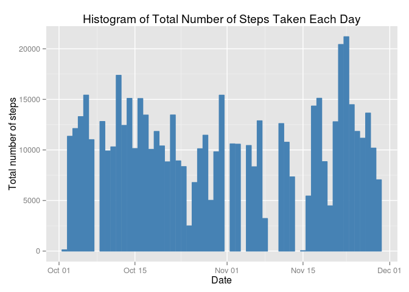
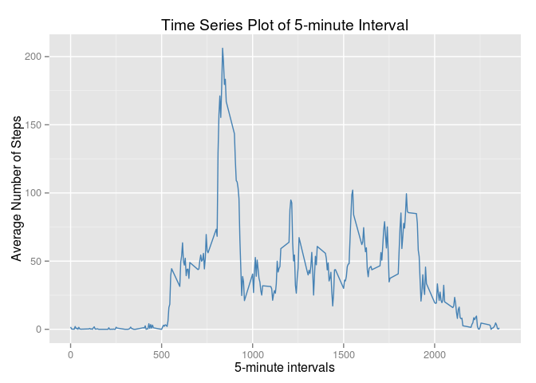
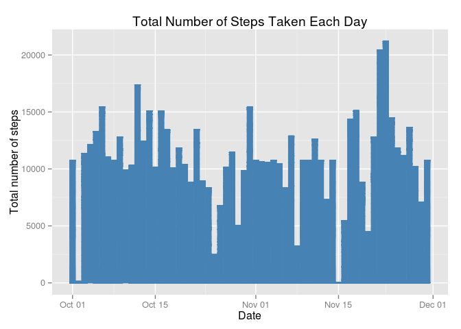

# Reproducible Research: Peer Assessment 1


```r
#setwd("D:/MyDocs/Lynn/Books/coursera/Reproducible_Research/RepData_PeerAssessment1")
library(ggplot2)
library(lubridate)
library(lattice)
#library(dplyr)
library(dplyr,warn.conflicts=FALSE)
```

## Loading and preprocessing the data


```r
unzip("activity.zip")
data<-read.csv("activity.csv",)
data$date<-ymd(data$date)
data_noNA<-data[which(data$steps!="NA"),]
head(data_noNA)
```

```
##     steps       date interval
## 289     0 2012-10-02        0
## 290     0 2012-10-02        5
## 291     0 2012-10-02       10
## 292     0 2012-10-02       15
## 293     0 2012-10-02       20
## 294     0 2012-10-02       25
```

## What is mean total number of steps taken per day?

1. Make a histogram of the total number of steps taken each day


```r
steps_per_day<-data_noNA %>%
  group_by(date) %>%
  summarize(steps=sum(steps))
head(steps_per_day)
```

```
## Source: local data frame [6 x 2]
## 
##         date steps
## 1 2012-10-02   126
## 2 2012-10-03 11352
## 3 2012-10-04 12116
## 4 2012-10-05 13294
## 5 2012-10-06 15420
## 6 2012-10-07 11015
```

```r
ggplot(steps_per_day,aes(date,steps))+ geom_bar(stat="identity", color = "steelblue", fill = "steelblue") + labs(title = "Histogram of Total Number of Steps Taken Each Day", x = "Date", y = "Total number of steps")
```

 

2. Calculate and report the **mean** and **median** total number of steps taken per day


```r
mean_noNA<-mean(steps_per_day$steps)
median_noNA<-median(steps_per_day$steps)
mean_noNA
```

```
## [1] 10766.19
```

```r
median_noNA
```

```
## [1] 10765
```

## What is the average daily activity pattern?

1. Make a time series plot (i.e. `type = "l"`) of the 5-minute interval (x-axis) and the average number of steps taken, averaged across all days (y-axis)


```r
steps_per_interval<-data_noNA %>%
  group_by(interval) %>%
  summarize(steps=mean(steps))
head(steps_per_interval)
```

```
## Source: local data frame [6 x 2]
## 
##   interval     steps
## 1        0 1.7169811
## 2        5 0.3396226
## 3       10 0.1320755
## 4       15 0.1509434
## 5       20 0.0754717
## 6       25 2.0943396
```

```r
ggplot(steps_per_interval, aes(interval, steps)) + geom_line(color = "steelblue") + labs(title = "Time Series Plot of 5-minute Interval", x = "5-minute intervals", y = "Average Number of Steps")
```

 

2. Which 5-minute interval, on average across all the days in the dataset, contains the maximum number of steps?


```r
filter(steps_per_interval,steps==max(steps))
```

```
## Source: local data frame [1 x 2]
## 
##   interval    steps
## 1      835 206.1698
```

## Imputing missing values

1. Calculate and report the total number of missing values in the dataset (i.e. the total number of rows with `NA`s)


```r
sum(is.na(data))
```

```
## [1] 2304
```

2. Devise a strategy for filling in all of the missing values in the dataset. The strategy does not need to be sophisticated. For example, you could use the mean/median for that day, or the mean for that 5-minute interval, etc.

use **mean for the 5-minute interval** as the filling of missing values.

3. Create a new dataset that is equal to the original dataset but with the missing data filled in.

```r
data_NA<-select(data[is.na(data$steps),],date,interval)
data_NA<-merge(data_NA,steps_per_interval,by="interval")

data_bind<-rbind(data_noNA,data_NA)
data_bind<-arrange(data_bind,date,interval)
head(data_bind)
```

```
##       steps       date interval
## 1 1.7169811 2012-10-01        0
## 2 0.3396226 2012-10-01        5
## 3 0.1320755 2012-10-01       10
## 4 0.1509434 2012-10-01       15
## 5 0.0754717 2012-10-01       20
## 6 2.0943396 2012-10-01       25
```

4. Make a histogram of the total number of steps taken each day and Calculate and report the **mean** and **median** total number of steps taken per day. Do these values differ from the estimates from the first part of the assignment? What is the impact of imputing missing data on the estimates of the total daily number of steps?


```r
ggplot(data_bind, aes(date, steps)) + geom_bar(stat = "identity",color = "steelblue",fill = "steelblue") + labs(title = "Total Number of Steps Taken Each Day", x = "Date", y = "Total number of steps")
```

 

```r
new_steps_per_day<-data_bind %>%
  group_by(date) %>%
  summarize(steps=sum(steps))
head(new_steps_per_day)
```

```
## Source: local data frame [6 x 2]
## 
##         date    steps
## 1 2012-10-01 10766.19
## 2 2012-10-02   126.00
## 3 2012-10-03 11352.00
## 4 2012-10-04 12116.00
## 5 2012-10-05 13294.00
## 6 2012-10-06 15420.00
```

```r
mean_all<-mean(new_steps_per_day$steps)
median_all<-median(new_steps_per_day$steps)
mean_all-mean_noNA
```

```
## [1] 0
```

```r
median_all-median_noNA
```

```
## [1] 1.188679
```

the new mean of total steps taken per day is the same as the old mean; the new median of total steps taken per day is greater than the old median.


```r
new_steps_per_interval<-data_bind %>%
  group_by(interval) %>%
  summarize(steps=mean(steps))
head(new_steps_per_interval)
```

```
## Source: local data frame [6 x 2]
## 
##   interval     steps
## 1        0 1.7169811
## 2        5 0.3396226
## 3       10 0.1320755
## 4       15 0.1509434
## 5       20 0.0754717
## 6       25 2.0943396
```

```r
new_steps_per_interval$steps-steps_per_interval$steps
```

```
##   [1] 0 0 0 0 0 0 0 0 0 0 0 0 0 0 0 0 0 0 0 0 0 0 0 0 0 0 0 0 0 0 0 0 0 0 0
##  [36] 0 0 0 0 0 0 0 0 0 0 0 0 0 0 0 0 0 0 0 0 0 0 0 0 0 0 0 0 0 0 0 0 0 0 0
##  [71] 0 0 0 0 0 0 0 0 0 0 0 0 0 0 0 0 0 0 0 0 0 0 0 0 0 0 0 0 0 0 0 0 0 0 0
## [106] 0 0 0 0 0 0 0 0 0 0 0 0 0 0 0 0 0 0 0 0 0 0 0 0 0 0 0 0 0 0 0 0 0 0 0
## [141] 0 0 0 0 0 0 0 0 0 0 0 0 0 0 0 0 0 0 0 0 0 0 0 0 0 0 0 0 0 0 0 0 0 0 0
## [176] 0 0 0 0 0 0 0 0 0 0 0 0 0 0 0 0 0 0 0 0 0 0 0 0 0 0 0 0 0 0 0 0 0 0 0
## [211] 0 0 0 0 0 0 0 0 0 0 0 0 0 0 0 0 0 0 0 0 0 0 0 0 0 0 0 0 0 0 0 0 0 0 0
## [246] 0 0 0 0 0 0 0 0 0 0 0 0 0 0 0 0 0 0 0 0 0 0 0 0 0 0 0 0 0 0 0 0 0 0 0
## [281] 0 0 0 0 0 0 0 0
```

the total daily number of steps is not affected by the imputing missing data.

## Are there differences in activity patterns between weekdays and weekends?

1. Create a new factor variable in the dataset with two levels -- "weekday" and "weekend" indicating whether a given date is a weekday or weekend day.


```r
data_bind<-mutate(data_bind,wday=factor(wday(date)))
head(data_bind)
```

```
##       steps       date interval wday
## 1 1.7169811 2012-10-01        0    2
## 2 0.3396226 2012-10-01        5    2
## 3 0.1320755 2012-10-01       10    2
## 4 0.1509434 2012-10-01       15    2
## 5 0.0754717 2012-10-01       20    2
## 6 2.0943396 2012-10-01       25    2
```

```r
levels(data_bind$wday)<-list(weekday = c(2,3,4,5,6),weekend = c(1,7))
head(data_bind)
```

```
##       steps       date interval    wday
## 1 1.7169811 2012-10-01        0 weekday
## 2 0.3396226 2012-10-01        5 weekday
## 3 0.1320755 2012-10-01       10 weekday
## 4 0.1509434 2012-10-01       15 weekday
## 5 0.0754717 2012-10-01       20 weekday
## 6 2.0943396 2012-10-01       25 weekday
```

2. Make a panel plot containing a time series plot (i.e. `type = "l"`) of the 5-minute interval (x-axis) and the average number of steps taken, averaged across all weekday days or weekend days (y-axis).


```r
wday_steps_per_interval<-data_bind %>%
  group_by(interval,wday) %>%
  summarize(steps=mean(steps))
head(wday_steps_per_interval)
```

```
## Source: local data frame [6 x 3]
## Groups: interval
## 
##   interval    wday      steps
## 1        0 weekday 2.25115304
## 2        0 weekend 0.21462264
## 3        5 weekday 0.44528302
## 4        5 weekend 0.04245283
## 5       10 weekday 0.17316562
## 6       10 weekend 0.01650943
```

```r
xyplot(steps~interval|wday,data=wday_steps_per_interval,layout=c(1,2),type = "l", xlab = "Interval", ylab = "Number of steps")
```

 

